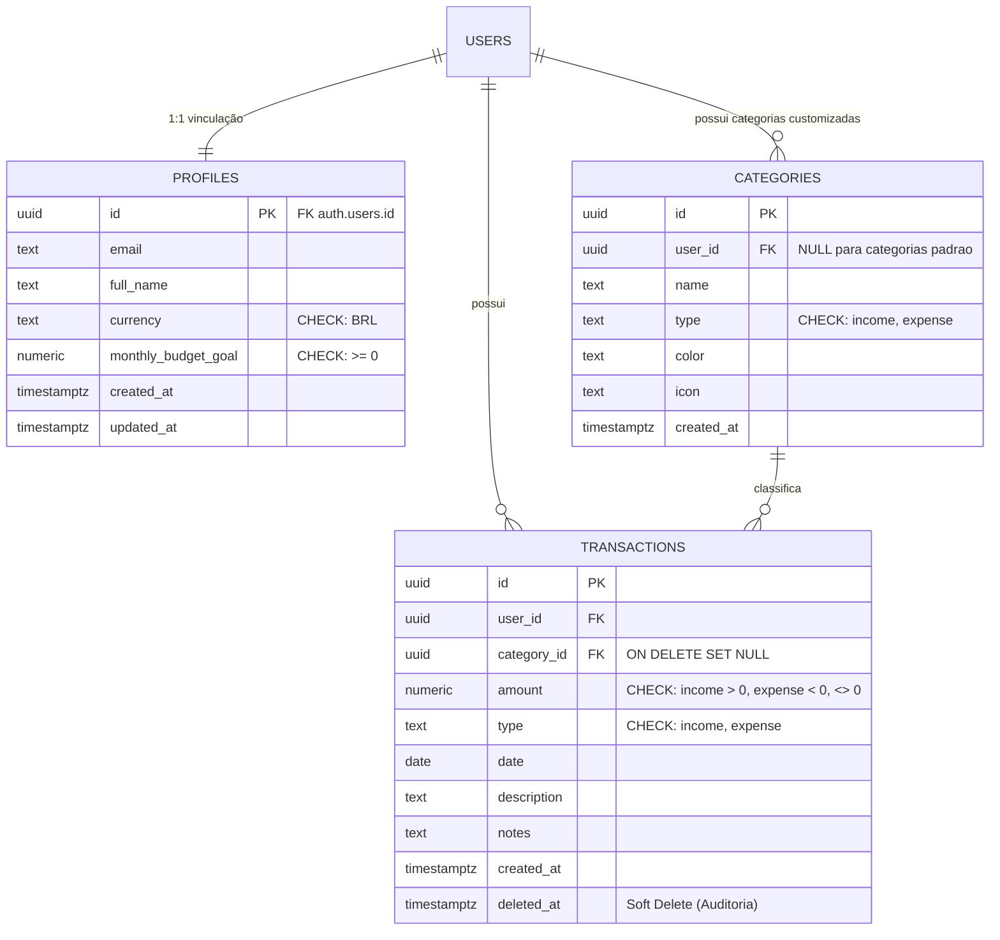
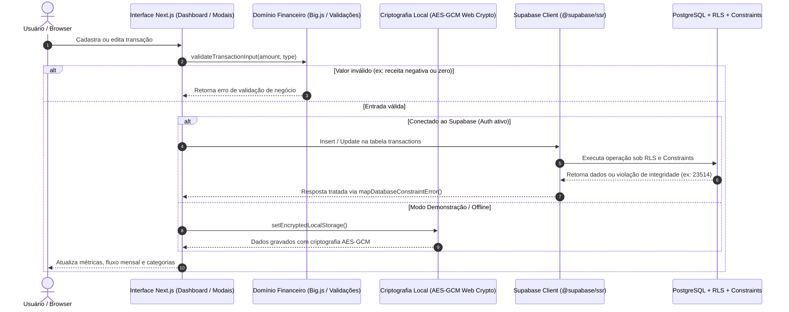

# FinançasPro - Aplicativo de Orçamento Pessoal

Uma plataforma moderna, segura e de alta precisão para planejamento financeiro e gestão orçamentária pessoal. Desenvolvida com a versão mais recente do **Next.js (App Router)**, **React 19**, **Supabase (PostgreSQL 15+ com RLS e Auth)**, precisão monetária arbitrária com **Big.js** e estilização artesanal em **Vanilla CSS** com tema escuro nativo (_Obsidian Glassmorphism_).

---

## 📋 Sumário Executivo (Overview)

O **FinançasPro** foi projetado para solucionar problemas críticos recorrentes em ferramentas financeiras convencionais:

1. **Precisão Aritmética Absoluta**: Eliminação de discrepâncias de arredondamento causadas pela representação binária de ponto flutuante IEEE 754 (como `0.1 + 0.2 = 0.30000000000000004`), utilizando matemática decimal exata em todas as agregações, taxas e projeções.
2. **Segurança Ancorada na Camada de Dados (Source-Level Security)**: Validações financeiras e restrições de integridade impostas diretamente no PostgreSQL (`CHECK constraints`), impedindo inconsistências mesmo se regras de frontend forem contornadas.
3. **Preservação e Não-Destrutividade (Soft Delete)**: Proteção de dados através de deleção lógica com campos de data/hora (`deleted_at`), viabilizando auditoria, preservação de histórico e recuperação simplificada.
4. **Resiliência e Privacidade Híbrida**: Funcionamento duplo transparente — opera integrado à nuvem via Supabase com Row-Level Security (RLS) ou em modo demonstração/offline com criptografia em repouso no navegador (AES-GCM de 256 bits via Web Crypto API).

---

## 📂 Estrutura de Diretórios do Projeto

Abaixo está a representação fiel de 100% da estrutura de diretórios e arquivos do projeto:

```text
personal-budget-app/
├── app/
│   ├── favicon.ico                         # Ícone da aplicação
│   ├── globals.css                         # Design System (tokens CSS, tema Obsidian, glassmorphism)
│   ├── layout.tsx                          # Layout raiz com metadata e fontes
│   ├── page.module.css                     # Estilos modulares da página principal
│   ├── page.tsx                            # Dashboard financeiro principal (roteador '/')
│   └── reset-password/
│       └── page.tsx                        # Rota de recuperação e redefinição de senha
├── components/
│   ├── Auth/
│   │   └── AuthModal.tsx                   # Modal de autenticação (Login, Registro e Recuperação)
│   ├── Charts/
│   │   ├── CategoryDoughnut.tsx            # Gráfico de rosca SVG interativo de despesas por categoria
│   │   └── IncomeExpenseChart.tsx          # Gráfico de barras SVG interativo de receitas vs despesas
│   ├── Navbar.tsx                          # Barra de navegação com indicador de status e perfil
│   ├── StatCard.tsx                        # Cards de métricas financeiras (Saldo, Receitas, Despesas, Poupança)
│   └── Transactions/
│       ├── TransactionItem.tsx             # Card individual de transação com ações e formatação
│       ├── TransactionList.tsx             # Lista de transações com filtros multi-critério e busca
│       └── TransactionModal.tsx            # Modal de cadastro e edição com validações de sinal
├── lib/
│   ├── api/
│   │   └── errorHandler.ts                 # Tratamento padronizado de erros de API e autorização
│   ├── demoData.ts                         # Categorias padrão do sistema e massa de demonstração
│   ├── financial.ts                        # Núcleo de domínio financeiro com Big.js (regras puras)
│   ├── formatters.ts                       # Formatadores de moeda (BRL pt-BR), percentual e datas
│   ├── logger.ts                           # Logger seguro (oculta valores e dados sensíveis em produção)
│   ├── services/
│   │   └── transactionService.ts           # Serviço de soft delete e mapeamento de erros do Postgres
│   ├── storage/
│   │   └── encryptedStorage.ts             # Armazenamento criptografado (AES-GCM Web Crypto)
│   ├── supabase/
│   │   └── client.ts                       # Inicialização do Supabase Client via @supabase/ssr
│   ├── types.ts                            # Contratos de tipos TypeScript do sistema
│   └── __tests__/
│       └── financial.test.ts               # Suíte de testes unitários com Vitest (18 testes)
├── public/                                 # Ativos estáticos e vetores SVG
├── supabase/
│   └── schema.sql                          # DDL do PostgreSQL: tabelas, RLS, triggers e constraints
├── ARCHITECTURE.md                         # Baseline de arquitetura, versionamento e regras
├── eslint.config.mjs                       # Configuração do ESLint 9
├── next.config.ts                          # Configuração do Next.js 16
├── package.json                            # Manifesto de dependências e scripts do projeto
├── README.md                               # Documentação técnica e guia do sistema
└── tsconfig.json                           # Configurações do compilador TypeScript
```

---

## 🏛️ Padrões de Arquitetura (Layered Architecture)

O sistema segue uma **Arquitetura em Camadas (Layered Architecture)** com separação estrita de responsabilidades:

1. **Camada de Apresentação (`app/`, `components/`)**:
   - Componentes React puros e interativos.
   - Renderização dos gráficos em SVG nativo de alto desempenho (sem dependências pesadas de bibliotecas de terceiros).
   - Estilização orientada a tokens em Vanilla CSS, garantindo controle pixel-perfect e ausência de sobrecarga de build.

2. **Camada de Domínio Financeiro (`lib/financial.ts`, `lib/formatters.ts`)**:
   - Funções puras e desacopladas de I/O.
   - Utilização obrigatória da biblioteca `big.js` para garantir imutabilidade e precisão decimal de alta fidelidade.
   - Validações de convenção de sinal: receitas devem ser estritamente positivas e despesas devem ser negativas no modelo financeiro.

3. **Camada de Serviços & Persistência Segura (`lib/services/`, `lib/storage/`, `lib/supabase/`)**:
   - `transactionService.ts`: orquestra a deleção lógica (`softDeleteTransaction`) e traduz códigos de erro do PostgreSQL (como o erro `23514` de violação de check constraint) para mensagens amigáveis ao usuário.
   - `encryptedStorage.ts`: utiliza derivação de chaves e criptografia autenticada AES-GCM para proteger dados em repouso no `localStorage`.
   - `client.ts`: utiliza `@supabase/ssr` (`createBrowserClient`) em conformidade com as práticas recomendadas para o Next.js App Router.

---

## 📊 Diagramas de Arquitetura e Fluxo

### 1. Diagrama Entidade-Relacionamento (ERD)

O modelo de dados implementado no PostgreSQL via [supabase/schema.sql](supabase/schema.sql) garante isolamento rigoroso por usuário e integridade a nível de banco:



### 2. Diagrama de Fluxo de Dados e Processamento (Sequence Diagram)

Demonstração do ciclo de vida de uma operação financeira no sistema:



---

## 🛠️ Tecnologias Principais

- **Frontend Core**: [Next.js 16.3.5](https://nextjs.org/) (Turbopack, App Router) & [React 19.2.8](https://react.dev/)
- **Linguagem**: [TypeScript 5](https://www.typescriptlang.org/) (modo estrito)
- **Aritmética Decimal**: [Big.js 7.0.1](https://github.com/MikeMcl/big.js/)
- **Backend & Banco de Dados**: [Supabase](https://supabase.com/) (PostgreSQL 15+, Row Level Security, Auth JWT)
- **Integração SSR / Browser**: `@supabase/ssr: ^0.12.7` e `@supabase/supabase-js: ^2.116.0`
- **Ícones**: [Lucide React](https://lucide.dev/)
- **Estilização**: CSS Vanilla com Custom Properties e Glassmorphism
- **Testes**: [Vitest 5.0.2](https://vitest.dev/)

---

## 🚀 Guia de Execução do Ambiente

### 1. Pré-requisitos

- **Node.js**: Versão `>= 20.0.0` (recomendado: Node 20 LTS ou superior).
- **Gerenciador de Pacotes**: `npm` (incluso com o Node.js).
- **Conta Supabase** (opcional para rodar localmente no modo demo, obrigatória para persistência em nuvem).

### 2. Instalação de Dependências

Clone o repositório e instale as dependências:

```bash
git clone <url-do-repositorio>
cd personal-budget-app
npm install
```

### 3. Configuração do Supabase e Banco de Dados

1. No painel do seu projeto no [Supabase](https://supabase.com/), abra o **SQL Editor**.
2. Copie e execute o conteúdo do arquivo [supabase/schema.sql](supabase/schema.sql).
   - O script cria as tabelas `profiles`, `categories` e `transactions`.
   - Aplica as políticas de **Row Level Security (RLS)** otimizadas com cache de `auth.uid()`.
   - Adiciona constraints de integridade financeira e insere as categorias padrão do sistema.
   - Configura a trigger com `search_path = ''` para criação automática de perfil após cadastro.

3. Configure as variáveis de ambiente criando o arquivo `.env.local`:

```bash
cp .env.local.example .env.local
```

4. Preencha as chaves da API obtidas em **Project Settings > API**:

```env
NEXT_PUBLIC_SUPABASE_URL=https://seu-projeto.supabase.co
NEXT_PUBLIC_SUPABASE_ANON_KEY=sua-chave-anon-publica
```

_(Nota: Caso as variáveis não sejam configuradas, o aplicativo iniciará automaticamente no **Modo Demonstração Interativo**, salvando os dados de teste de forma criptografada no navegador)._

### 4. Executando o Servidor de Desenvolvimento

Inicie o servidor de desenvolvimento com suporte ao Turbopack:

```bash
npm run dev
```

Abra [http://localhost:3000](http://localhost:3000) no seu navegador para utilizar a aplicação.

---

## 🧪 Qualidade de Código e Testes

O projeto conta com scripts automatizados para garantir integridade matemática, tipagem e estilo:

- **Executar Testes Unitários de Integridade Financeira**:

  ```bash
  npm run test
  ```

  _(Executa 18 testes automatizados em `lib/__tests__/financial.test.ts` cobrindo precisão Big.js, formatação BRL, Soft Delete e restrições de integridade)_

- **Checagem de Tipagem TypeScript**:

  ```bash
  npx tsc --noEmit
  ```

- **Verificação de Linter (ESLint)**:

  ```bash
  npm run lint
  ```

- **Verificação de Formatação (Prettier)**:

  ```bash
  npx prettier --check .
  ```

- **Compilação de Produção**:
  ```bash
  npm run build
  ```
